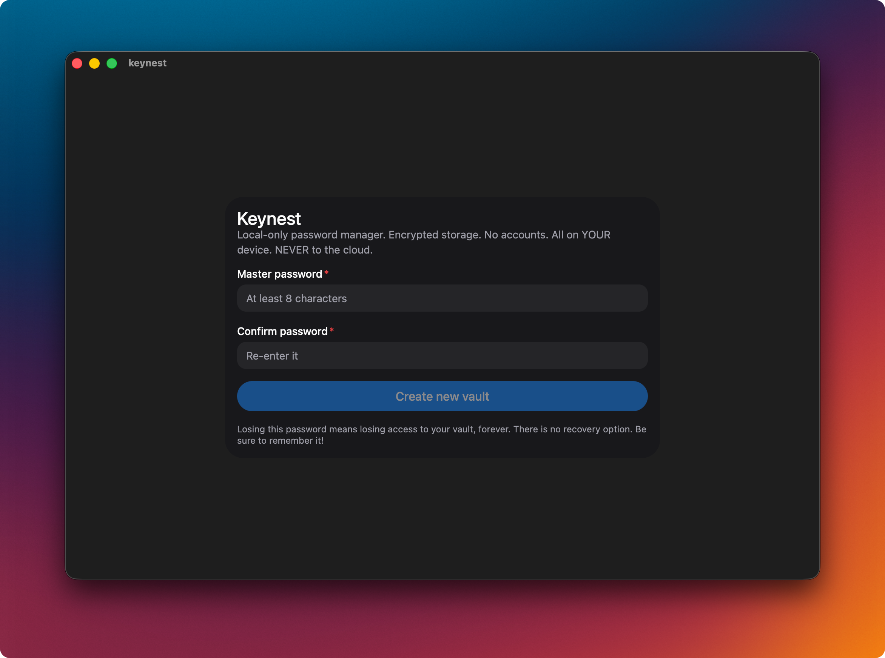
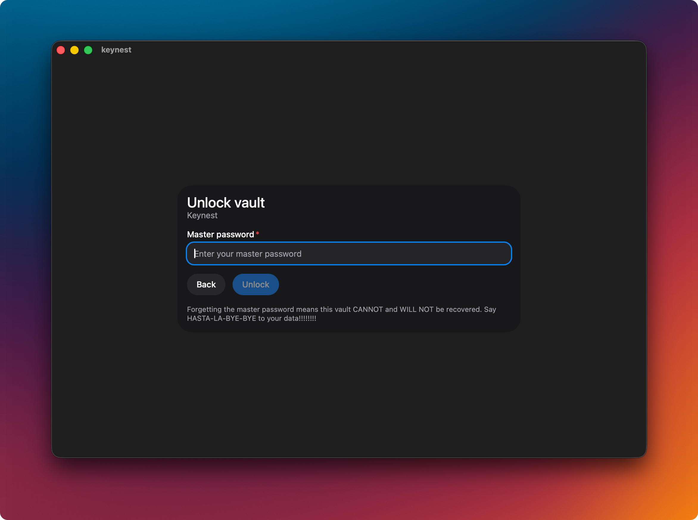
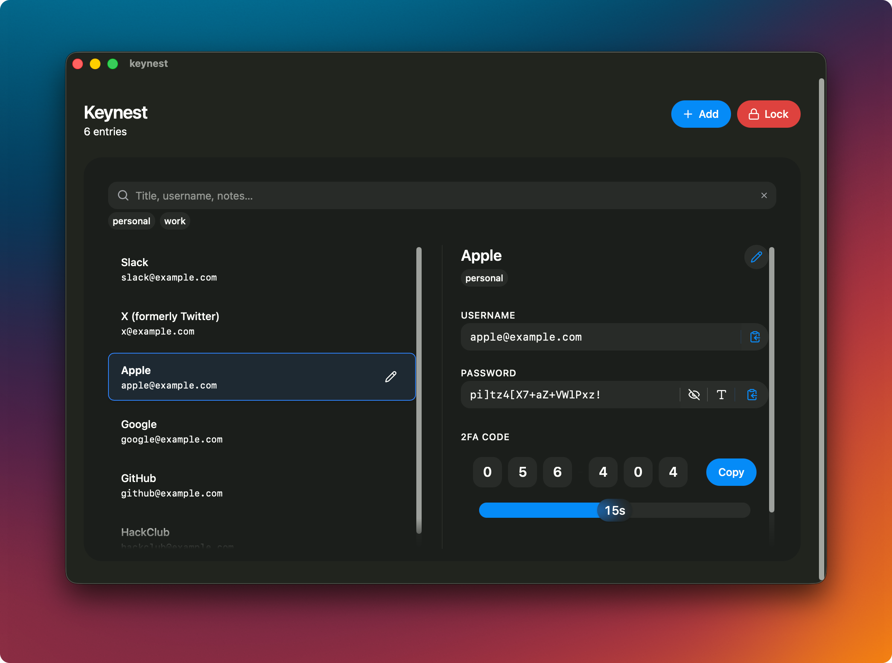
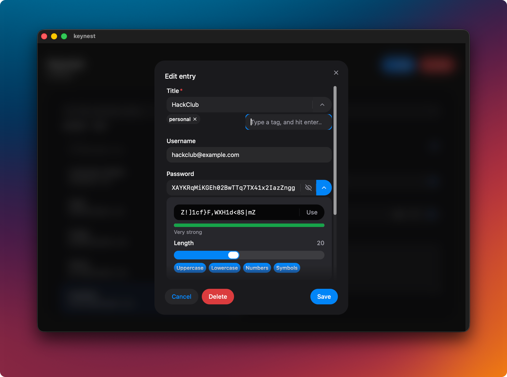

# Keynest

A local-only password manager built with Tauri + React.

## Features

- Encrypted vault stored locally
- Master password unlock
- Create, edit, search entries
- Clipboard auto-clear
- No cloud, no sync

## Threat model

- Vault is encrypted at rest
- No plaintext passwords written to disk
- No network access

## Tech stack

- Tauri (Rust)
- React + Vite
- pnpm

## Images

### First open, set master password



### Unlock vault



### Vault view



### Entry edit view



## Development

```bash
pnpm install
pnpm tauri:dev
```

## Build

```
pnpm tauri:build
```

## Notes

- This project was built solo!!

## License

MIT License. See LICENSE for details.
